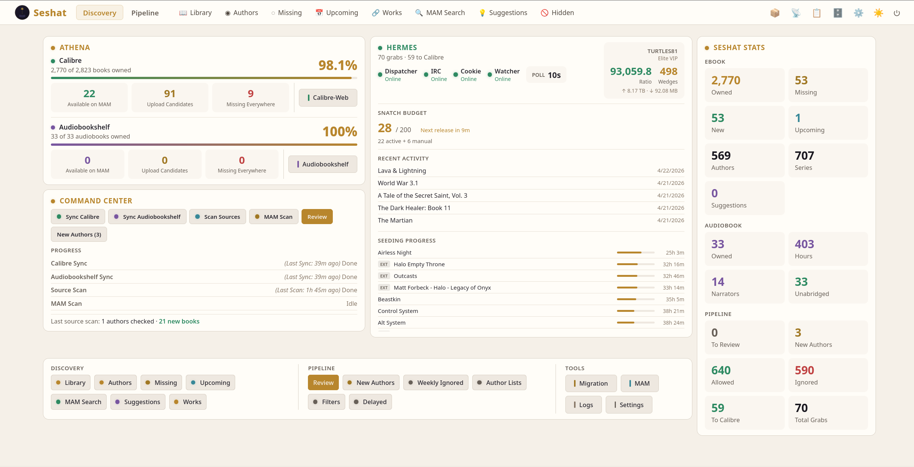

<div align="center">


# Seshat

**Self-hosted book discovery and acquisition platform.**

Scans your Calibre library against multiple metadata sources, searches
a private tracker for missing titles, and automates the full pipeline
from IRC announce monitoring through torrent management, metadata
enrichment, and Calibre delivery — all from a single unified interface.

*Named after the Egyptian goddess of writing, libraries, and record-keeping.*

[](https://github.com/malevolenttortoise/seshat/releases/latest)
[](https://github.com/malevolenttortoise/seshat/actions/workflows/docker-publish.yml)
[](LICENSE)
[](https://github.com/malevolenttortoise/seshat/pkgs/container/seshat)

[](https://www.python.org/)
[](https://react.dev/)
[](https://github.com/malevolenttortoise/seshat/commits/main)
[](https://github.com/malevolenttortoise/seshat/pkgs/container/seshat)

</div>

---

## Two domains, one app

### Discovery

Sync your Calibre library and find every book you're missing across
9 metadata sources (Goodreads, Hardcover, Kobo, Amazon, IBDB, Google
Books, Open Library, Audible, MAM). Manage authors, series, and
pen-name aliases. Search MAM for matches and see which titles are
available.

Per-source coverage, priority defaults, the Cloudflare bypass behind
Goodreads, and the resolver chain that maps ISBN/ASIN → Goodreads ID
without scraping `/search` are all documented in
[`docs/metadata-sources.md`](docs/metadata-sources.md).

Container restarts run an **incremental sync** by default — Calibre's
`last_modified` column and Audiobookshelf's `updatedAt` field drive a
filtered read that only re-processes books that actually changed.
Most restarts complete in under a second; the lifespan no longer
blocks request handling, and a sticky progress banner (or full-screen
splash on first-ever boot) surfaces status while sync runs in the
background.

### Pipeline

Monitor MAM's IRC announce channel in real time. Filter against your
author lists, evaluate economic policy (VIP, freeleech, wedge, ratio),
manage a snatch budget, download through your torrent client, enrich
metadata from 7 sources, queue everything for manual review with cover
images, and deliver approved books to Calibre/CWA.

### Audiobook support

Audiobookshelf is a first-class library backend. Seshat discovers your
ABS library alongside Calibre, pulls metadata from Audible + Audnexus,
routes audiobook MAM grabs through a dedicated sink, and triggers a
scan on the ABS server so new books show up without a manual refresh.

Cross-library *works* link the same book across ebook + audiobook
libraries so your Discovery views can show "Foundation" as one entity
with both formats. Per-author tracking preferences let you pin an
author to ebook-only, audiobook-only, or both — missing detection and
MAM scans respect the preference automatically.

### Unified Dashboard

Discovery stats, pipeline stats, and per-library sync rows (Calibre +
ABS side-by-side) all live on a single three-column dashboard. Stats
rail on the right, Quick Actions across the bottom.

---

## Screenshots

<div align="center">



</div>

---

## Quick start (Docker)

```yaml
services:
  seshat:
    image: ghcr.io/malevolenttortoise/seshat:latest
    container_name: seshat
    ports:
      - "8789:8789"
    volumes:
      - ./data:/app/data
      - /path/to/calibre/books:/calibre:ro
      - /path/to/audiobookshelf/library:/audiobooks   # optional
      - /path/to/downloads:/downloads
      - ./staging:/staging
      - ./review-staging:/review-staging
    environment:
      CALIBRE_PATH: "/calibre"
    restart: unless-stopped
```

Then open `http://your-server:8789` and follow the first-run wizard.
If you're adding Audiobookshelf, point it at the same `/audiobooks`
mount so Seshat can drop new audiobook files straight into ABS's
library path — Seshat will trigger a scan on the ABS server as soon
as the file lands.

### Image variants

Two image tags ship from each commit:

| Tag | Size | Use when |
|---|---|---|
| `ghcr.io/malevolenttortoise/seshat:latest` | ~860MB | You want the **direct Calibre sink** (`calibredb add`). Bundles Calibre's official binary build. |
| `ghcr.io/malevolenttortoise/seshat:latest-slim` | ~200MB | You ingest via the **CWA**, **ABS**, or **file-folder** sinks and don't need direct calibredb access. Saves ~660MB. |

If you select the Calibre sink in Settings on the slim image, the
sink will fail with a clear "calibredb not found" error pointing
you back here. Switching variants is a `docker pull` away — Seshat's
state lives entirely on the `/app/data` volume.

---

## Architecture

- **Backend:** Python 3.12 + FastAPI + SQLite (WAL mode) + aiosqlite
- **Frontend:** Vite + React 18 + TypeScript
- **Databases:** Separate SQLite files — per-library discovery DBs + pipeline DB + auth DB
- **Background jobs:** supervised asyncio tasks + APScheduler
- **Auth:** bcrypt + itsdangerous signed cookies + Fernet-encrypted secrets
- **Theme:** Egyptian goddess palette (gold, deep indigo, jade green)
- **Docker:** two-stage build (node:22-alpine + python:3.12-slim)
- **API routes:** 187 total (103 discovery + 84 pipeline)
- **Library backends:** Calibre (file-based) + Audiobookshelf (API-based),
  composable — users can run multiple of either. Cross-library `works`
  linked via the pipeline DB.

---

## Requirements

- **Docker** (recommended) or Python 3.12+ for development
- A **Calibre library** (mounted read-only for discovery sync)
- A **MAM** account with IRC credentials + session cookie
- A **torrent client** (qBittorrent, Transmission, Deluge, or rTorrent)
- *Optional:* **Audiobookshelf** (URL + API key) for audiobook support,
  Hardcover API key, ntfy server for notifications

---

## Configuration

Most configuration lives in **Settings** inside the running app. Environment
variables only seed *initial* values on first boot — once Seshat has written
to its `settings.json`, the file is the source of truth and env vars are
ignored. Re-deploying with a different env var doesn't override a setting
the user already saved through the UI.

### Volumes

| Mount path | Required | Purpose |
| --- | :---: | --- |
| `/app/data` | yes | Seshat's persistent state — `settings.json`, per-library `seshat_<slug>.db`, pipeline DB, auth DB, encrypted secrets store. **Never delete.** |
| `/calibre` | yes (if using Calibre) | Calibre library directory — read-only is fine. Seshat reads `metadata.db` to discover books. |
| `/audiobooks` | optional | Audiobookshelf library path — same volume ABS sees, so Seshat can drop new audiobook files where ABS will scan them. |
| `/downloads` | recommended | qBit's download directory as Seshat sees it (the other side of the qBit/Seshat path translation). |
| `/staging` | recommended | Intermediate folder where new grabs land before review. |
| `/review-staging` | recommended | Where books wait while pending manual review. |

### Environment variables

All env vars are *optional* — each one seeds a corresponding setting on
first boot only. Use them when you'd rather configure via Docker compose
than fill out the first-run wizard.

#### Core

| Variable | Default | Purpose |
| --- | --- | --- |
| `WEBUI_HOST` | `0.0.0.0` | Bind address for the FastAPI server. |
| `WEBUI_PORT` | `8789` | HTTP port. |
| `SESHAT_AUTH_SECRET` | *(generated)* | Cookie-signing secret. Auto-generated and persisted on first boot if unset; setting it explicitly lets you survive `/app/data` wipes without forcing re-login. Minimum 32 chars. |
| `SESHAT_MODE` | *(auto)* | `production` / `dev` override. Defaults to "production" inside Docker. |
| `SESHAT_DRY_RUN` | `false` | Disables MAM bonus-buy + auto-grab actions globally — useful for staging. Truthy values: `true`, `1`, `yes`. |
| `VERBOSE_LOGGING` | `false` | Promotes DEBUG logs from Seshat's loggers. |

#### MAM credentials

| Variable | Purpose |
| --- | --- |
| `MAM_SESSION_ID` | `mam_id` cookie value. Pasted from a fresh browser session. Re-rotated automatically when MAM kills it. |
| `MAM_IRC_NICK` | IRC nickname for `irc.myanonamouse.net`. |
| `MAM_IRC_ACCOUNT` | IRC account name (often the same as nick). |
| `MAM_IRC_PASSWORD` | IRC services password (NOT your MAM site password). |

#### Torrent client (qBittorrent today)

| Variable | Default | Purpose |
| --- | --- | --- |
| `QBIT_URL` | *(empty)* | e.g. `http://10.0.10.20:8080` |
| `QBIT_USERNAME` | *(empty)* | Web UI username. |
| `QBIT_PASSWORD` | *(empty)* | Web UI password. |
| `QBIT_WATCH_CATEGORY` | `[mam-reseed]` | Category Seshat manages. Books move through this category as they progress. |
| `QBIT_TAG` | `seshat-seed` | Comma-separated tags applied to every torrent Seshat submits. |

#### Library backends

| Variable | Purpose |
| --- | --- |
| `CALIBRE_PATH` / `CALIBRE_LIBRARY_PATH` | Filesystem path to your Calibre library inside the container. Either name works (legacy `CALIBRE_PATH` kept for compatibility). |
| `CALIBRE_URL` | Calibre Content Server URL — only needed for the Calibre direct-import sink. |
| `CALIBRE_WEB_URL` | Calibre-Web instance URL. Surfaced as a Quick Action button on the Dashboard if set. |
| `ABS_URL` | Audiobookshelf base URL. The API key is set via the UI (encrypted at rest). |

#### Metadata + notifications

| Variable | Purpose |
| --- | --- |
| `HARDCOVER_API_KEY` | Hardcover.app GraphQL token. Without it Hardcover skips silently. |
| `NTFY_URL` | ntfy.sh-compatible push endpoint for new-grabs / review-ready / queue-emptied notifications. |

#### Other paths

| Variable | Default | Purpose |
| --- | --- | --- |
| `STAGING_PATH` | *(empty)* | Override for the staging folder location (rarely needed inside Docker — use the volume mount). |

#### MAM economy tunables (advanced)

These map MAM bonus-points exchange rates and only need overriding if MAM
changes their pricing.

| Variable | Default | Purpose |
| --- | --- | --- |
| `MAM_BP_PER_UPLOAD_GB` | `500` | BP cost per 1 GB upload-credit purchase. |
| `MAM_BP_PER_VIP_WEEK` | `1250` | BP cost per VIP week (5000 BP per 4-week chunk). |
| `MAM_BP_PER_PERSONAL_FL` | `50000` | BP cost per personal-FL flag. |

### Download folder structure

`Settings → Pipeline → Download Path / Folder Structure` controls how
Seshat lays out files inside your download directory:

| Mode | Layout |
| --- | --- |
| `monthly` | `<download_path>/[YYYY-MM]/<torrent>` *(default)* |
| `yearly` | `<download_path>/[YYYY]/<torrent>` |
| `author` | `<download_path>/<Author Name>/<torrent>` |
| `flat` | `<download_path>/<torrent>` (no subfolders) |
| `template` | User-defined nesting — see below |

**Template mode** lets you compose a folder structure from three tokens:
`{author}`, `{series}`, `{title}`. Slash separates levels. Empty segments
are dropped automatically — a standalone book in
`{author}/{series}/{title}` lands in `{author}/{title}` without manual
conditionals. Examples:

- `{author}` — same as `author` mode.
- `{author}/{series}` — group books by series under each author.
- `{author}/{series}/{title}` — full nesting, one folder per book.
- `{series}/{title}` — series-first organization (mixes authors at the top).

Tokens that aren't known at submit time resolve to empty. Discovery's
*Send to pipeline* path supplies all three; raw IRC announces only have
`{author}`, so segments referencing `{series}` or `{title}` drop out for
those grabs.

### PWA + offline behavior

Seshat is a Progressive Web App — installable on iOS, Android, and
desktop browsers, with offline browsing of cached pages and a dedicated
install prompt that appears 30 seconds into a session.

**The service worker only registers under HTTPS.** On plain-HTTP LAN
origins (e.g. `http://10.0.10.20:8789`), browsers silently refuse to
register service workers, so PWA features are limited to manifest-level
"Add to Home Screen" with no offline caching. To unlock the full PWA
behavior, front Seshat with HTTPS — a reverse proxy (Caddy / Traefik /
nginx), Cloudflare Tunnel, or Tailscale Funnel all work. Once HTTPS is
in place, the PWA layer activates automatically on the next page load
— no Seshat config change needed.

### Path translation (qBit ↔ Seshat)

Seshat and your torrent client typically see the download directory at
different mount points. qBit might report `/data/[mam-complete]/foo`
while Seshat's container has the same host directory mounted at
`/downloads/[mam-complete]/foo`. The `qbit_path_prefix` and
`local_path_prefix` settings (configured via the UI under
*Settings → Pipeline*) translate between the two namespaces so Seshat
can pre-create folders, find downloaded files, and hand the right path
back to qBit.

---

## License

[Apache-2.0](LICENSE)

---

<div align="center">

*Seshat finds the books. Seshat gets the books.*

</div>
